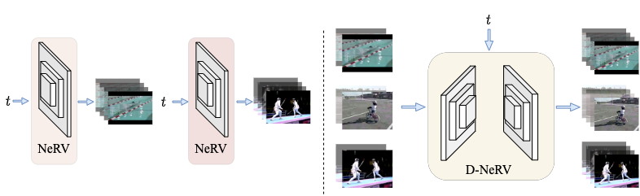
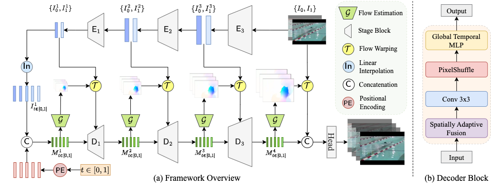

# Towards Scalable Neural Representation for Diverse Videos (CVPR2023)
### [Project Page](https://boheumd.github.io/D-NeRV/) | [Paper](https://arxiv.org/abs/2303.14124)
The  official repository of our paper "**Towards Scalable Neural Representation for Diverse Videos**".

<p align="center">

</p>


## Model Overview
<p align="center">

</p>


## Requirements
You can install the conda environment by running:
```bash
conda create -n dnerv python=3.9.7
conda activate dnerv
conda install pytorch torchvision pytorch-cuda=11.7 -c pytorch -c nvidia
pip install tensorboard
pip install tqdm dahuffman pytorch_msssim
```

## Video Compression
We adopt the existing deep [image compression models](https://arxiv.org/abs/2001.01568) provided by CompressAI.
We provide the pre-extracted ground-truth video frames and pre-compressed keyframes for [UVG](https://ultravideo.fi/#testsequences) and [UCF101](https://www.crcv.ucf.edu/data/UCF101.php) datasets in [this google drive link](https://drive.google.com/drive/folders/1iTWdJT4YfkyT0DrIp7MUnGQVjhlwKay7?usp=sharing).

Unzip it under the `data/` folder and make sure the data structure is as below.
   ```
    ├── data
        └── UVG
            ├── gt
            ├── keyframe
            ├── annotation
        └── UCF101
            ├── gt
            ├── keyframe
            ├── annotation
   ```
Please note that, we split the 1024x1920 UVG videos into non-overlap 256x320 frame patches during training due to the GPU memory limitation.


## Running
### Training
We train our model on 4 RTX-A6000 GPUs. To compare with other state-of-the-art video compression methods, we run for 1600 epochs on UVG dataset and 800 epochs on UCF101 dataset. You can change to a smaller number of epochs to reduce the training time. 
```bash
# UVG datset
python train.py --dataset UVG --model_type ${model_type} --model_size ${model_size} \
    -e 1600 -b 32 --lr 5e-4 --loss_type Fusion6 -d

# UCF101 datset
python train.py --dataset UCF101 --model_type ${model_type} --model_size ${model_size} \
    -e 800  -b 32 --lr 5e-4 --loss_type Fusion19 -d
```

### Testing
```bash
# Evaluate model without model quantization
python train.py --dataset UVG --model_type D-NeRV --model_size M \
        --eval_only --model saved_model/UVG/D-NeRV_M.pth

# Evaluate model with model quantization
python train.py --dataset UVG --model_type D-NeRV --model_size M \
        --eval_only --model saved_model/UVG/D-NeRV_M.pth --quant_model
```

### Dump Predicted Frames
```bash
python train.py --dataset UVG --model_type D-NeRV --model_size M \
        --eval_only --model saved_model/UVG/D-NeRV_M.pth --quant_model \
        --dump_images
```
Please note that, for the UVG dataset, after we splitting 1024x1920 videos into 256x320 frame patches, the PSNR/MS-SSIM results will be different from the actual PSNR/MS-SSIM of 1024x1920.
Therefore, we need to dump the predicted frame patches first, and then re-evaluate the PSNR/MS-SSIM with the ground-truth 1024x1980 video frames.

## PSNR/MS-SSIM vs. BPP Ratio Calculation

### UVG Dataset
Results for different model configs are shown in the following table.
The PSNR/MS-SSIM results are reported from the model with quantization.
|Model | Arch | Model Param(M) | Entropy Encoding | Keyframe Size(Mb) | Total(Mb) | BPP | PNSR | MS-SSIM | Link |
|:----:|---|:-----:|:-----:|:-----:|:-----:|:------:|:-----:|:------:|:----:|
|D-NeRV| XS| 8.02  | 0.883 | 88.39 | 145.0 | 0.0189 | 34.11 | 0.9479 |[`link`](https://drive.google.com/file/d/1gHDSQ7v_dt0l186Xet7W7ZwS8saNPEyX/view?usp=share_link)|
|D-NeRV| S | 15.96 | 0.881 | 88.39 | 200.9 | 0.0262 | 34.76 | 0.9540 |[`link`](https://drive.google.com/file/d/1N8OaRxfX-ENOFQzhHVwdonqNtpjhdpIo/view?usp=sharing)|
|D-NeRV| M | 24.20 | 0.880 | 123.2 | 293.6 | 0.0383 | 35.74 | 0.9604 |[`link`](https://drive.google.com/file/d/1SlDWeYdHIzSZl5OI2y_Ihx1Vg_duZRRg/view?usp=share_link)|
|D-NeRV| L | 41.66 | 0.877 | 175.1 | 467.3 | 0.0609 | 36.78 | 0.9668 |[`link`](https://drive.google.com/file/d/1tatqIq9LASRK2HfFAE3XYKD7rZfabqpI/view?usp=share_link)|
|D-NeRV| XL| 69.75 | 0.875 | 254.7 | 730.3 | 0.0952 | 37.43 | 0.9719 |[`link`](https://drive.google.com/file/d/1m_2X5Wmyvx5MPSaSl1FiIhbYwBB5ikXV/view?usp=share_link)|

### UCF101 Dataset (training split)

|Model | Arch | Model Param(M) | Entropy Encoding | Keyframe Size(Mb) | Total(Mb) | BPP | PNSR | MS-SSIM | Link |
|:----:|---|:-----:|:-----:|:-----:|:-----:|:------:|:-----:|:------:|:----:|
|D-NeRV| S | 21.40 | 0.882 | 481.6 | 632.7 | 0.0559 | 28.11 | 0.9153 |[`link`](https://drive.google.com/file/d/1HO1gBt0Ugce2HqH6feXiGTbOkNncZwlv/view?usp=share_link)|
|D-NeRV| M | 38.90 | 0.891 | 481.6 | 758.7 | 0.0671 | 29.15 | 0.9364 |[`link`](https://drive.google.com/file/d/1vbm5htwEsT3Lfnuqa9qxUonn7cBpbnO-/view?usp=share_link)|
|D-NeRV| L | 61.30 | 0.891 | 481.6 | 918.3 | 0.0812 | 29.97 | 0.9501 |[`link`](https://drive.google.com/file/d/1rVe0OwlUQHK6CmXn3NH2ILBx_oocYYf1/view?usp=share_link)|
| NeRV | S | 88.00 | 0.903 |       | 635.9 | 0.0562 | 26.78 | 0.9094 |[`link`](https://drive.google.com/file/d/1t8qZ2ZgLrosIhCnex37qIESguHTR2JgI/view?usp=share_link)|
| NeRV | M | 105.3 | 0.900 |       | 758.4 | 0.0671 | 27.06 | 0.9177 |[`link`](https://drive.google.com/file/d/1LYHDOu_qRy0exfpLr7cCPbV-0Ww2Pp19/view?usp=share_link)|
| NeRV | L | 127.2 | 0.903 |       | 919.1 | 0.0813 | 27.61 | 0.9284 |[`link`](https://drive.google.com/file/d/1jUN9nS-L_MUKSM3kQNe7p0hu3B7ADRfu/view?usp=share_link)|

### BPP Calculation
$BPP=\dfrac{\overbrace{\text{Model Param} * 8}^{\text{int8 quantization}} * \text{Entropy Encoding} + \text{Keyframe Size}}{\text{H} * \text{W} * \text{Num Frames}}$

For UVG dataset, H = 1024, W = 1920, Num Frames = 3900.

For UCF101 dataset, training split, H = 256, W = 320, Num Frames = 138041.

## Citation
If you find our code or our paper useful for your research, please **[★star]** this repo and **[cite]** the following paper:

```latex
@inproceedings{he2023dnerv,
  title = {Towards Scalable Neural Representation for Diverse Videos},
  author = {He, Bo and Yang, Xitong and Wang, Hanyu and Wu, Zuxuan and Chen, Hao and Huang, Shuaiyi and Ren, Yixuan and Lim, Ser-Nam and Shrivastava, Abhinav},
  booktitle = {Proceedings of the IEEE/CVF Conference on Computer Vision and Pattern Recognition (CVPR)},
  year = {2023},
}
```


